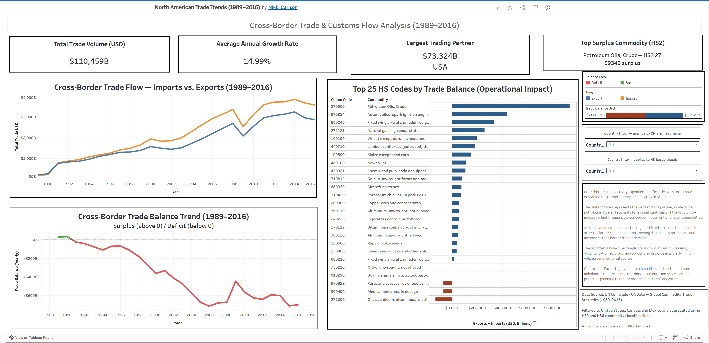

# Cross-Border Trade & Customs Flow Analysis (1989–2016)

## Project Overview

This project analyzes cross-border trade flows between the United States, Canada, and Mexico to understand commodity distribution, trade imbalances, and their impact on cross-border freight movement and customs operations.

The dashboard highlights how trade volume, commodity concentration, and trade balance shifts influence customs processing, documentation requirements, and border congestion.

---

## Key Focus Areas

- Cross-border trade volume and growth trends  
- Trade balance shifts over time  
- High-volume HS-coded commodity categories  
- Operational impact on freight movement and customs processing  

---

## Key Insight

Cross-border trade activity expanded significantly, with total trade exceeding $110T and average annual growth of ~15%.

High-volume commodities—particularly crude petroleum (HS2-27)—drive frequent cross-border movement, increasing documentation workload and classification risk.

As trade volumes increased, the region shifted into a sustained deficit, indicating growing dependency on imports and increased cross-border freight demand.

These patterns directly impact customs processing efficiency, documentation accuracy, and border congestion.

**Operational Focus:** High-volume commodities and sustained trade imbalances require strong customs documentation processes and proactive planning to reduce border delays and congestion.

---

## Dashboard Preview

---

## Live Dashboard

[View Interactive Tableau Dashboard](https://public.tableau.com/app/profile/nikki.carlson2355/viz/nafta_17626310339920/NAFTATradeOverview)

---

## Data Source

UN Comtrade / UNData — Global Commodity Trade Statistics (1989–2016)

Filtered to United States, Canada, and Mexico and aggregated using HS2 and HS6 commodity classifications.

All values are reported in USD (billions).

---

## Notes

- The dataset used in this project is large and not included in this repository due to size constraints  
- Data was processed and aggregated for analysis in Tableau  
- A sample dataset may be provided for reference if needed  

---

## Tools Used

- Tableau (dashboard development and visualization)
