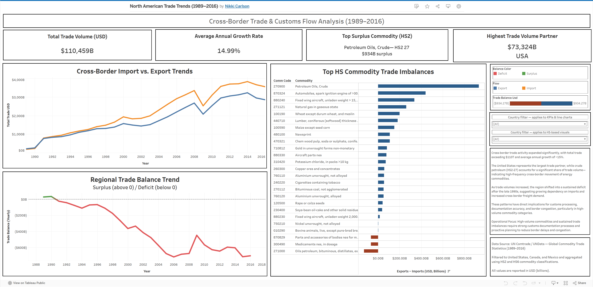

# Cross-Border Trade & Customs Flow Analysis (1989–2016)

## Project Overview

This project analyzes cross-border trade flows between the United States, Canada, and Mexico to identify long-term trade trends, commodity concentration, and operational impacts on freight movement and customs processing.

The dashboard focuses on how trade growth, trade imbalances, and high-volume commodity categories influence:

- customs documentation workload
- border congestion
- freight demand
- operational planning requirements

The analysis is designed from a logistics and customs operations perspective rather than a purely economic perspective.

---

## Business Questions

This analysis focuses on answering:

1. How did cross-border trade volumes change over time?
2. Which commodity groups generated the highest trade imbalances?
3. How did trade deficits and surpluses shift across the region?
4. Which commodities are most likely to create sustained customs processing pressure?
5. What operational risks emerge as trade activity and import dependency increase?

---

## Key Findings

- Cross-border trade activity expanded significantly from 1989–2016, exceeding $110T in total trade volume.
- Petroleum commodities (HS2-27) represented one of the largest contributors to cross-border trade imbalance and freight movement.
- The region shifted into a sustained trade deficit beginning in the late 1990s, increasing dependency on imports and freight activity.
- High-volume commodity concentration creates increased customs documentation requirements and greater risk of border congestion.
- Trade growth directly impacts operational planning, freight coordination, and customs processing efficiency.

---

## Operational Relevance

This project highlights how trade patterns influence real-world logistics and customs operations, including:

- customs documentation workload
- border crossing efficiency
- freight flow concentration
- import dependency
- operational bottlenecks

The dashboard was designed to support operational awareness rather than purely financial reporting.

---

## Dashboard Preview

---

## Live Dashboard

[View Interactive Tableau Dashboard](https://public.tableau.com/app/profile/nikki.carlson2355/viz/nafta_17626310339920/NAFTATradeOverview)

---

## Data Source

UN Comtrade / UNData — Global Commodity Trade Statistics (1989–2016)

### Dataset filtered to:
- United States
- Canada
- Mexico

### Commodity classifications:
- HS2
- HS6

All values reported in USD (billions).

---

## Tools Used

- Tableau (dashboard development and visualization)
- Kaggle datasets
- Data filtering and preprocessing
- Trade flow and commodity imbalance analysis

---

## Notes

- The dataset used in this project is large and is not fully included in this repository.
- Data was filtered and aggregated prior to dashboard development.
- This project focuses on operational trade analysis and customs flow impacts rather than macroeconomic forecasting.
